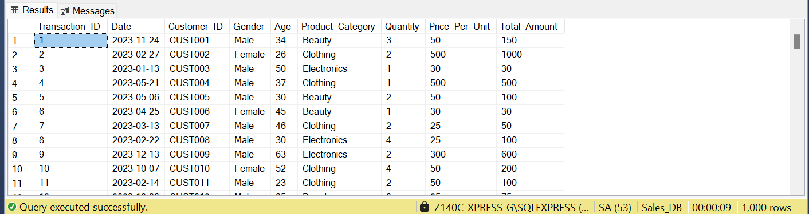
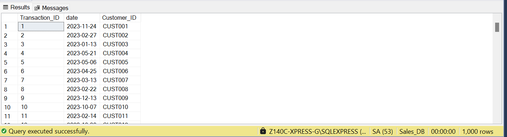
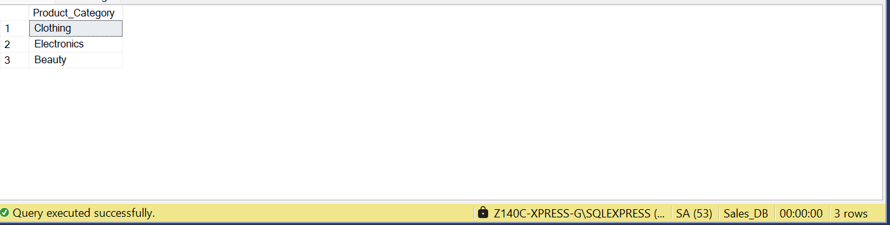
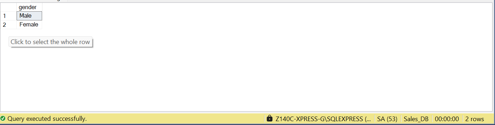
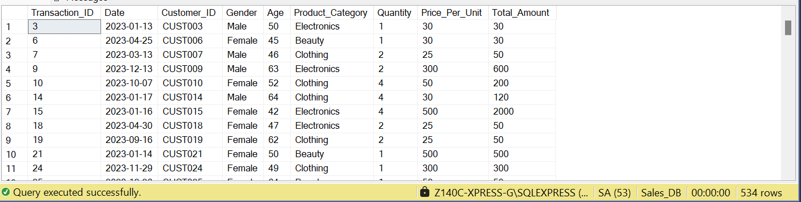
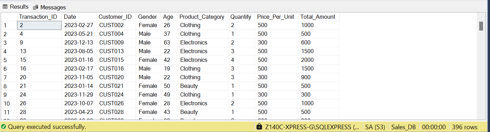
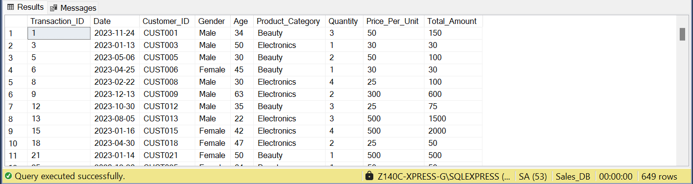
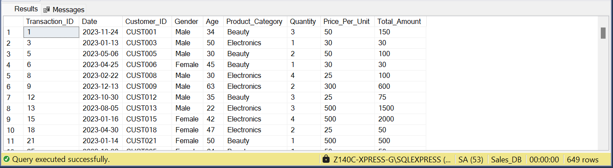
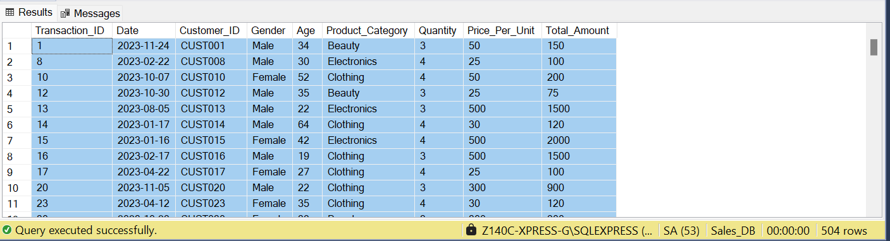

## SQL---Practical-1
### Retail_Sales_Dataset

## Table of Contents

  - [Project Overview](#project-overview)
  - [Data Source](#data-source)
  - [Tools](tools)
  - [Data Analysis](#data-analysis)
    
## Project Overview

#### This data analysis practical aims to provide insights into the sales performance of a retail_sales_dataset for the past year. By analysing various aspects of the sales data, we seek to make data-driven recommendations, and gain a deeper understanding of the company's performance. 



















### Data Source

Sales Data: The primary dataset used for this analysis is the "retail_sales_dataset.csv" file, containing detailed informaion about each sale made by the company.

### Tools

#### Microsoft SQL Server - Data Analysis

### Data Analysis

```SQL

SELECT *
FROM retail_sales_dataset;

SELECT Transaction_ID, [date], Customer_ID
FROM retail_sales_dataset;

SELECT DISTINCT Product_Category
FROM retail_sales_dataset;

SELECT DISTINCT gender
FROM retail_sales_dataset;

SELECT *
FROM retail_sales_dataset
WHERE age > 40;

SELECT Transaction_ID, [Date], Customer_ID, Gender, Age, Product_Category, Quantity, Price_Per_Unit, Total_Amount
FROM retail_sales_dataset
WHERE Price_Per_Unit BETWEEN 100 AND 500;

SELECT *
FROM retail_sales_dataset
WHERE Product_Category IN ('Beauty') OR Product_Category = 'Electronics';

SELECT *
FROM retail_sales_dataset
WHERE Product_Category NOT IN ('Clothing');

SELECT *
FROM retail_sales_dataset
WHERE Quantity >= 3;

```

